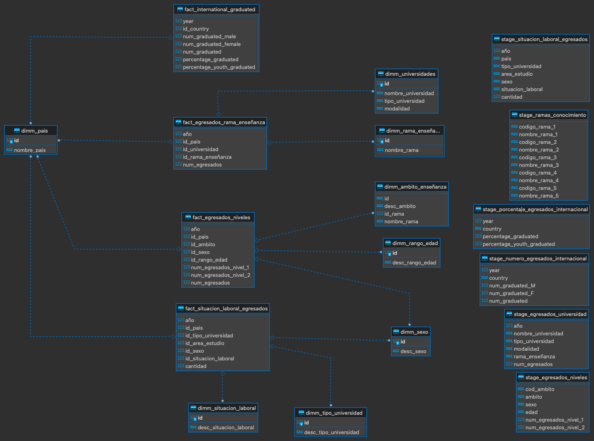

# dw-airflow-training

Ejercicio de entrenamiento para poblar un DW por medio de Apache Airflow


## Setup

1. Crear archivo `.env` con la variable AIRFLOW_UID
```
echo -e "AIRFLOW_UID=$(id -u)" > .env
```

2. Editar .env y añadir librerias requeridas
```
_PIP_ADDITIONAL_REQUIREMENTS=openpyxl
```

Si requiere añadir mas librerias, debe editar la variable `_PIP_ADDITIONAL_REQUIREMENTS` separadando las librerias por comas, por ejemplo:
```
_PIP_ADDITIONAL_REQUIREMENTS=openpyxl,pandas
```

3. En el directorio `data/raw` puede encontar las fuentes de datos originales:
```
data
└── raw
    ├── 03003.xlsx
    ├── ISCED_2013.csv
    ├── SEGR1.csv
    ├── SEGR2.csv
    ├── educ_uoe_grad01.xlsx
    ├── educ_uoe_grad05.xlsx
    └── grad_5sc.csv
```

4. Inicializar Airflow
```
docker compose up airflow-init
```

5. Conectate a la base de datos MySQL y ejecuta la migración `create_tables.sql`, la cual puedes encontrar en la carpeta migrations

## Consejos

### Preprocesamiento

El objetivo del prepocesamiento es transformar los archivos crudos en un archivo en formato tabular, de manera que la lectura de los datos pueda ser interpretada de manera similar a una serie de tiempo. Como ayuda, tenga en cuenta los siguientes puntos:

1. Los archivos `educ_uoe_grad01.xls` y `educ_uoe_grad05.xls` tienen mas de una hoja, por lo que deberá corroborar si necesita la información en todas las hojas o solo una de ellas contiene la información. Adicionalmente, encontrará que las tablas con los datos no estan en las primeras filas, por lo que deberá determinar a partir de que filas y columnas debe leer los datos.

2. Algunas de los archivos entregadas no están bien codificadas, ya que va a encontrar en algunos datos el simbolo �, por lo que deberá determinar cual es la codificación correcta para esas hojas.

3. A excepción de los archivos `educ_uoe_grad01.xls` y `educ_uoe_grad05.xls`, las demas hojas pertenecen a información correspondiente al pais españa, para un determinado año. Por lo tanto, va a tener que añadir a esos archivos procesados dos nuevas columnas, año y pais.

4. Tenga cuidado cuando lea algunos archivos, muchos de ellos contienen un código que puede ser interpretado como entero pero debe ser interpretado como string.

5. No está de mas agregar que los datos deben tener consistencia, enfoquese especialmente en los archivos correspondientes a españa.

# Modelo DW

